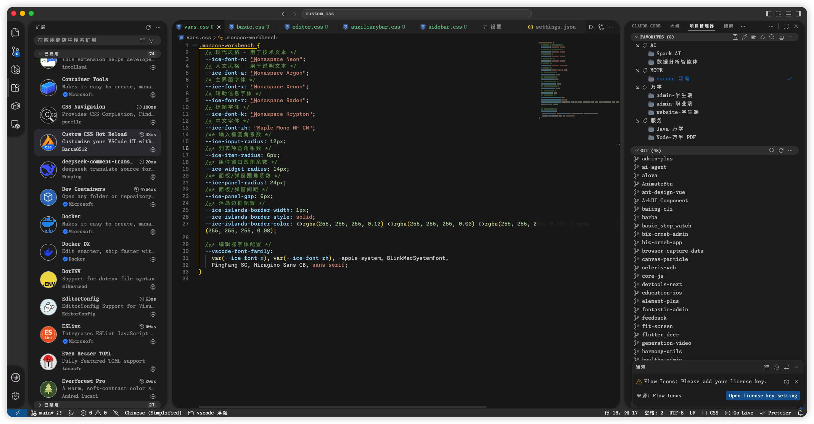

# VSCode Custom CSS - 浮岛风格

一套基于 VSCode **Dark+** 主题的 Custom CSS 样式，将 VSCode 的各功能面板改造为独立浮岛（Floating Islands）风格——每个面板拥有独立的圆角、边框和阴影，整体更加现代精致。



## 效果预览

- **活动栏**、**侧边栏**、**编辑器**、**辅助栏** 各自独立为"浮岛"，带有统一的圆角与阴影
- 自定义滚动条样式，细窄圆角滑块
- 输入框、下拉框、命令面板统一圆角风格
- 插件市场图标圆形裁剪
- 通知浮层带毛玻璃边框
- 底部状态栏透明化，Remote 指示器按钮风格

> ⚠️ **注意**：本项目目前仅在 **macOS** 环境下实际使用和测试，其他操作系统（Windows、Linux）尚未验证，请谨慎使用。

## 前置条件

### 1. 安装 Custom CSS Hot Reload 插件

本项目的 CSS 样式依赖 [Custom CSS Hot Reload](https://marketplace.visualstudio.com/items?itemName=bartag.custom-css-hot-reload) 插件来注入 VSCode。

安装后，在 VSCode 的 `settings.json` 中添加以下配置：

```json
{
  "customCss.imports": [
    "file:///Users/<your-username>/.vscode/custom_css/index.css"
  ]
}
```

> **注意**：请将路径中的 `<your-username>` 替换为你的实际用户名。你也可以将本项目克隆到任意位置，只需将 `customCss.imports` 指向 `index.css` 的绝对路径即可。

### 2. 安装所需字体

本项目使用 Monaspace 和 Maple Mono NF CN 字体系列：

```bash
brew install --cask font-monaspace
brew install --cask font-maple-mono-nf-cn
```

| CSS 变量 | 字体 | 用途 |
| --- | --- | --- |
| `--ice-font-n` | Monaspace Neon | 现代风格，用于技术文本 |
| `--ice-font-a` | Monaspace Argon | 人文风格，用于说明文本 |
| `--ice-font-x` | Monaspace Xenon | 主界面字体 |
| `--ice-font-r` | Monaspace Radon | 辅助信息字体 |
| `--ice-font-k` | Monaspace Krypton | 标题字体 |
| `--ice-font-zh` | Maple Mono NF CN | 中文字体 |

### 3. 主题设置

建议搭配 VSCode 内置的 **Dark+** 主题使用：

1. 打开命令面板（`Cmd+Shift+P`）
2. 选择 `Preferences: Color Theme`
3. 选择 `Dark+` (default-dark-themes)
4. 打开命令面板（`Cmd+Shift+P`）
5. 选择 `Preferences: Product Icon Theme`
6. 选择 `Default`

## 文件结构

```
custom_css/
├── index.css          # 入口文件，汇总所有样式
├── vars.css           # CSS 变量定义（字体、圆角、间距、边框）
├── basic.css          # 全局基础样式（滚动条、输入框、下拉框、命令面板、通知等）
├── activitybar.css    # 左侧活动栏样式
├── sidebar.css        # 左侧导航栏样式
├── editor.css         # 编辑器主体及底部面板样式
├── auxiliarybar.css   # 右侧辅助栏样式
└── 1.png              # 效果截图
```

## 自定义

你可以通过修改 `vars.css` 中的 CSS 变量来调整整体风格：

```css
--ice-input-radius: 12px;    /* 输入框圆角 */
--ice-item-radius: 6px;      /* 列表项圆角 */
--ice-widget-radius: 14px;   /* 组件窗口圆角 */
--ice-panel-radius: 24px;    /* 面板圆角 */
--ice-panel-gap: 6px;        /* 面板间距 */
--ice-user-avatar: none;     /* 用户头像，默认为 none */
```

### 本地覆盖（推荐）

`vars.css` 中的 `--ice-user-avatar` 默认为 `none`。如需设置个人头像，请在项目根目录创建 `local.css`（此文件已被 `.gitignore` 忽略），内容如下：

```css
.monaco-workbench {
  --ice-user-avatar: url("https://your-avatar-url");
}
```

然后确保 `local.css` 在 `custom_css_hot_reload.imports` 中位于 `vars.css` 之后即可。

## 配置示例

以下是完整的 `settings.json` 配置示例，可直接参考或调整后使用：

```json
{
  "custom_css_hot_reload.hotReloadMode": "onSave",
  "custom_css_hot_reload.imports": [
    "file:///Users/***/.vscode/custom_css/vars.css",
    "file:///Users/***/.vscode/custom_css/local.css",
    "file:///Users/***/.vscode/custom_css/basic.css",
    "file:///Users/***/.vscode/custom_css/activitybar.css",
    "file:///Users/***/.vscode/custom_css/sidebar.css",
    "file:///Users/***/.vscode/custom_css/editor.css",
    "file:///Users/***/.vscode/custom_css/auxiliarybar.css"
  ],
  "workbench.colorCustomizations": {
    "[Dark+]": {
      "activityBar.inactiveForeground": "#cccccc",
      "focusBorder": "#00000000",
      "projectManager.sideBar.currentProjectHighlightForeground": "#007acc",
      "statusBarItem.remoteBackground": "#007acc",
      "titleBar.inactiveBackground": "#3c3c3c"
    }
  },
  "workbench.colorTheme": "Dark+",
  "editor.fontFamily": "'Monaspace Neon', 'Maple Mono NF CN', monospace"
}
```

## 鸣谢

本项目灵感来源于 [vscode-dark-islands](https://github.com/bwya77/vscode-dark-islands)，感谢原作者的精美设计。
